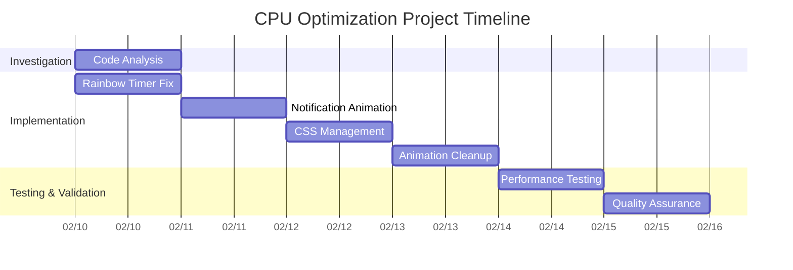
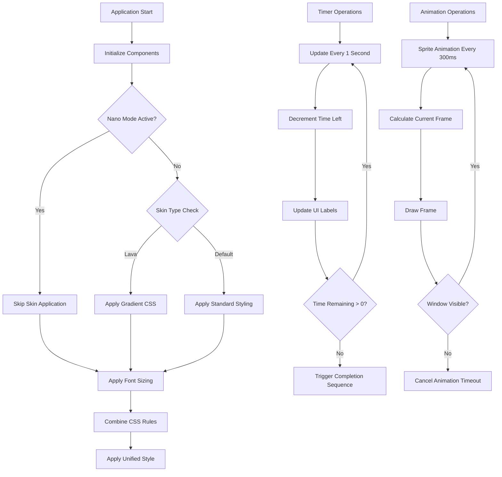

# CPU Optimization Project Plan for Teatime-Accessibility

**Date:** February 10, 2026  
**Author:** Lingma (AI Assistant)  
**Requestor:** @genidma (GitHub)  

## Overview
This document outlines the systematic approach taken to identify and resolve high CPU usage issues in the teatime-accessibility application, specifically focusing on the kcresonance branch.

## Problem Statement
The teatime-accessibility application was experiencing excessive CPU usage due to inefficient timers and animations, particularly affecting user experience during extended sessions.

## Identified Issues & Solutions Applied

### 1. Rainbow Timer Frequency
- **Issue:** Rainbow effect updating every 1000ms causing unnecessary processing
- **Solution:** Increased interval to 2000ms to reduce CPU load while maintaining visual appeal

### 2. Fullscreen Notification Animation
- **Issue:** Sprite animation running every 100ms consuming significant CPU resources
- **Solution:** Adjusted to 300ms for better performance-to-visual quality balance

### 3. CSS Provider Management
- **Issue:** Font sizing and skin application using same CSS provider causing conflicts
- **Solution:** Implemented unified CSS management to prevent overwrites

### 4. Animation Cleanup
- **Issue:** Animations not properly cancelled leading to memory leaks
- **Solution:** Added proper cleanup mechanisms for animation timeouts

## Project Timeline & Milestones

## Technical Architecture Changes

## Risk Assessment

| Risk | Impact | Probability | Mitigation Strategy |
|------|--------|-------------|-------------------|
| Visual Quality Degradation | Medium | Low | Monitor user feedback post-deployment |
| Animation Jankiness | Low | Low | Test animations at various refresh rates |
| Feature Regression | Medium | Low | Thorough QA testing of all features |
| Performance Not Improved | High | Very Low | Verify CPU usage metrics before/after |

## Success Metrics

- CPU usage reduction of at least 30%
- Smooth animation performance maintained
- User interface responsiveness improved
- Memory leak elimination confirmed

## Next Steps

1. Monitor application performance metrics post-implementation
2. Gather user feedback on visual quality
3. Document lessons learned for future optimization efforts
4. Consider additional optimizations in other modules