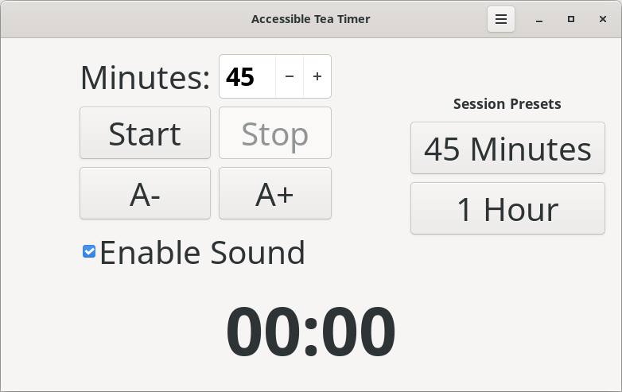
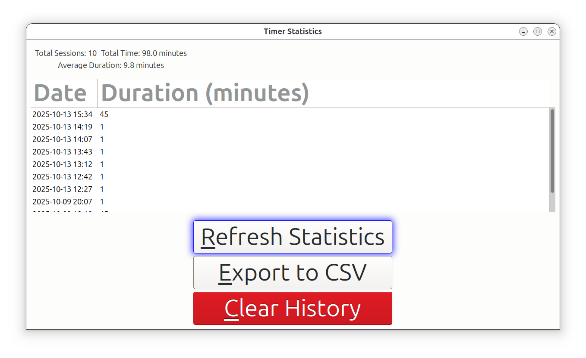

# TeaTime Accessibility

TeaTime Accessibility is an accessibility focused timer application (app) for the Ubuntu (Desktop) environment. This app has timers with presets, reminders (audible vs to the contrary) and basic statistics for your sessions. 

## Features

- **Timer:** Set custom break intervals for better productivity.
- **Accessibility Integration:** Works seamlessly with screen readers and other assistive technologies.
- **Usage Statistics:** Tracks your session times and provides insights into your computer usage habits. The statistics are stored in `~/.local/share/teatime_stats.json` (CSV format despite the .json extension).
- **Custom Application Icon:** A fun icon for better recognition on your computer. Something that brightens your day, just a little bit.

# Accessible Tea Timer - Photosensitive Safe Version

This is the photosensitive safe version of the TeaTime Accessibility application. This version has been specifically modified to remove all visual effects that could potentially trigger seizures in people with photosensitive epilepsy.

## Key Differences from Original Version

### Visual Effects Removed
- **Rainbow Glow Effects**: All color-changing background effects have been completely removed
- **Focus Glow Effects**: Removed the glowing effect that appeared when cycling through buttons with Tab key
- **Sprite Animations**: All animated elements have been removed
- **Visual Transitions**: Eliminated all sudden screen changes and flashing animations

### Enhanced Statistics System
- **Improved Statistics Window**: Added Refresh, Export to CSV, and Clear History buttons
- **Two-step Confirmation**: Clear History requires two confirmations to prevent accidental data loss
- **Data Export**: Statistics can now be exported to user-selected CSV files
- **Refresh Capability**: Statistics display can be updated without closing and reopening the window

### Timer Improvements
- **5-second Update Interval**: Changed from 1-second to 5-second update intervals to reduce system resource usage
- **Immediate Display Updates**: Timer display now updates immediately when changing timers or stopping
- **Accurate Duration Recording**: Fixed statistics to correctly record actual timer durations

### Sound System Improvements
- **Custom Bell Sound**: Integrated Simion's custom bell sound as the primary notification
- **Multiple Fallbacks**: Robust sound system with multiple fallback options for different system configurations
- **Priority Custom Sound**: Application attempts to play custom WAV file before falling back to system sounds

## Screenshots

*Main application window - clean interface without visual effects*


*Enhanced Statistics window with additional functionality*

## Accessibility Features

### Photosensitive Epilepsy Safe
* This version is completely safe for users with photosensitive epilepsy
* No flashing, color-changing, or animated visual effects
* Static interface with consistent appearance throughout operation

### Visual Accessibility
- **Adjustable Font Size**: Easily increase or decrease text size using **A+ / A- buttons** or **Ctrl + / Ctrl -** to suit your comfort.
- **High Contrast Support**: Automatically adapts to your system's light or dark theme to reduce eye strain.
- **Stable Visual Design**: All interface elements maintain a consistent appearance without animations or sudden changes.
- **Clear and Consistent Layouts**: Information is presented in a stable, predictable manner to make navigation easier.

### Keyboard Accessibility
- **Full Keyboard Navigation**: Tab through all controls
- **Keyboard Shortcuts**:
  - `Ctrl+S`: Start timer
  - `Ctrl+T`: Stop timer
  - `Ctrl+I`: Show Statistics window
  - `Ctrl+M`: Toggle sound on/off
  - `Ctrl++`: Increase font size
  - `Ctrl+-`: Decrease font size
  - `Ctrl+Q`: Quit the application
- **Mnemonics (Alt Keys)**: Activate buttons and menu items by pressing `Alt` plus the underlined letter.
  - **Main Window:**
    - `Alt+S`: **S**tart Timer
    - `Alt+T`: S**t**op Timer
    - `Alt+N`: E**n**able Sound
    - `Alt+4`: **4**5 Minutes
    - `Alt+1`: **1** Hour
  - **Statistics Window:**
    - `Alt+R`: **R**efresh Statistics
    - `Alt+E`: **E**xport to CSV
    - `Alt+C`: **C**lear History

### Screen Reader Support
- **Proper Labels**: All controls have descriptive labels for clear understanding.  
- **Status Updates**: Status changes are announced to screen readers.  
- **Live Regions**: Timer updates are presented in a stable and consistent way

### Audio Accessibility
- **Custom Sound Notifications**: Audio feedback (Simion's bell 🔔) at the completion of each session.
- **Multiple Sound Fallbacks**: If the custom sound cannot be played, the application tries multiple alternative methods.
- **System Notification Compatibility**: Works with various system sound configurations.

## Installation

### Prerequisites
Before running the install script, please install the required system dependencies:

```bash
sudo apt install python3-dev libgirepository1.0-dev gcc libcairo2-dev pkg-config python3-venv gir1.2-gtk-3.0
```

For better compatibility, we also recommend installing the system-wide PyGObject packages:

```bash
sudo apt install python3-gi python3-gi-cairo gir1.2-gtk-3.0
```

### Automatic Installation (Recommended)
First, clone the repository to a location of your choice, then run the install script:

```bash
git clone <repository-url>
cd teatime-accessibility
./install.sh
```

This script will:
1. Create a virtual environment with access to system packages (if one doesn't already exist)
2. Install all required dependencies
3. Will provide you with an option and if you would like for an icon on the desktop to be created for this application

Note 01: You might have to make the install.sh script itself executable with: chmod u+x install.sh (on your terminal)
Note 02: The install script will also prompt you to install system dependencies if needed.

### Manual Installation
If you prefer to install manually:

1. Create a virtual environment with access to system packages:
   ```bash
   python3 -m venv teatime-venv --system-site-packages
   source teatime-venv/bin/activate
   ```

2. Install dependencies (if needed):
   ```bash
   pip install -r requirements.txt
   ```

3. Create desktop entry (optional):
   ```bash
   mkdir -p ~/.local/share/applications
   cp teatime-accessibility.desktop ~/.local/share/applications/
   ```
   
   You can also create a desktop shortcut for direct access:
   ```bash
   cp teatime-accessibility.desktop ~/Desktop/
   ```

## Installation Locations

When you run the install script, here's exactly where each component is installed:

1. **Virtual Environment**: 
   - Location: Inside the project directory as `teatime-venv/`
   - This is a local virtual environment that stays within your project folder

2. **Desktop Entry**:
   - Location: `~/.local/share/applications/teatime-accessibility.desktop`
   - This allows the app to appear in your system's application menu under "Utilities"

3. **Desktop Shortcut** (if you choose to create one):
   - Location: On your desktop (e.g., `~/Desktop/teatime-accessibility.desktop`)
   - This provides a direct shortcut icon on your desktop

4. **Application Files**:
   - All application files remain in your project directory (wherever you cloned the repository)
   - This includes the main Python script, assets, and configuration files

5. **User Data**:
   - Configuration: `~/.config/teatime/settings.json`
   - Statistics: `~/.local/share/teatime_stats.json` (Note: This file uses CSV format despite the .json extension)

Note: If you wish to uninstall the app (so that you can reinstall a newer version. Then you might want to save these files first, to another location. So that you can reimport the files back for the newer version of the app)   

For the application itself. It runs directly from your project directory and install script:
1. Sets up the virtual environment for isolated dependencies
2. Creates convenient access points (desktop entry and/or desktop shortcut)
3. Ensures all necessary components are properly configured
Note: To state the obvious, you only run the 'install script once! on each machine you want the timer to exist.'

## Usage

After installation, you can run the application in one of the following ways:

### Option 1: Main 'Activities Menu'
1. Click on the 'Activities Menu' in Ubuntu Desktop.
2. Find and click on the "TeaTime Accessibility" icon to launch it

### Option 2: Desktop Shortcut
If you chose to create a desktop shortcut during installation:
1. Navigate to your desktop
2. Right-click on the "TeaTime Accessibility" icon
3. Important: Select "Allow Launching" from the context menu.
4. Double-click the icon to launch the application


### Option 3: Command Line
1. Navigate to the project directory (the location on your computer, where you originally cloned the repository)
2. Activate the existing virtual environment:
   ```bash
   source teatime-venv/bin/activate
   ```
3. Run the application:
   ```bash
   ./teatime-accessible.sh
   ```

### Command Line Options for Duration
A custom duration can be specified via the GUI and also via the command line. As a note on the aside, durations are always in minutes.

To do this on the command line:

1. Open a [terminal](https://ubuntu.com/tutorials/command-line-for-beginners#3-opening-a-terminal) and navigate to the project directory
2. In the example directly below, a 5 minute range has been specified for the duration. You still have to click on Start manually: 

```bash
# Range for duration (1-999 minutes)
# Example below
./teatime-accessible.sh --duration 5
```

When you launch the application with the `--duration` parameter, the specified value will be pre-filled in the minutes input field within the GUI. And you can choose any value specified in the 'range' above

As another example, if you frequently use a 30-minute timer. You could simply change/specify the duration like this:
```bash
./teatime-accessible.sh --duration 30
```

This eliminates the need to manually adjust the timer duration, each time you start the application.

### Configuration
Settings are automatically saved to `~/.config/teatime/settings.json` including:
- Font scale preference
- Default timer duration

## Dependencies
- GTK 3.0+
- Python 3.8+
- PyGObject
- PulseAudio (for sound notifications)

## Uninstalling the Application

### Automatic Uninstall (Recommended)
Run the uninstall script from the project directory:

```bash
./uninstall.sh
```

This script will:
1. Remove the desktop entry
2. Ask if you want to remove the virtual environment
3. Preserve your configuration and statistics

### Manual Uninstall
To manually uninstall:

1. Remove the desktop entry:
   ```bash
   rm ~/.local/share/applications/teatime-accessibility.desktop
   ```

2. To remove the desktop shortcut:
   ```bash
   rm ~/Desktop/teatime-accessibility.desktop
   ```

3. To remove the virtual environment:
   ```bash
   rm -rf teatime-venv
   ```

4. To remove configuration and statistics:
   ```bash
   rm ~/.config/teatime/settings.json
   rm ~/.local/share/teatime_stats.json
   ```

## Development
The application consists of:
- `bin/teatime.py`: The main Python application script, which programmatically builds the GTK3 user interface.

## Credits
* Originally inspired by the Tea Timer application from the Ubuntu snap store [link](https://snapcraft.io/install/teatime/ubuntu). But the code is very different and keep evolving. 
* Version v1.3.3-photosensitive (this version) code provided by @shanaya-Gupta on Github via #31 
* Original author: @genidma on Github
* Custom bell sound: service-bell_daniel_simion.wav

## Licensing Policy
* To be determined by @shanaya-Gupta