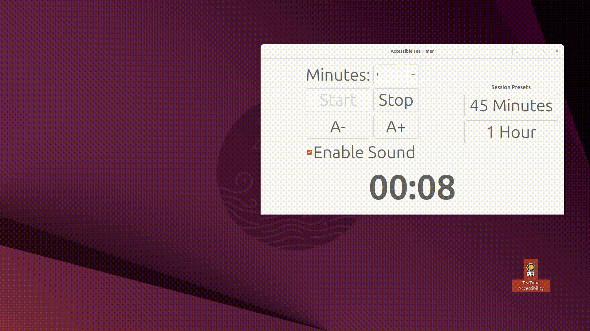
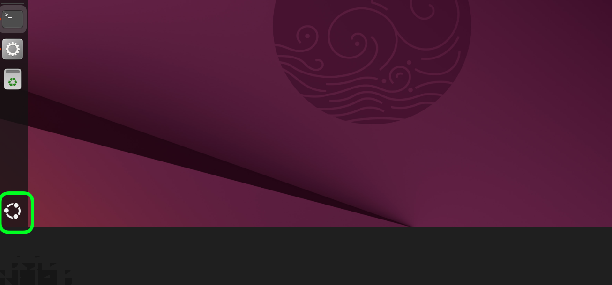
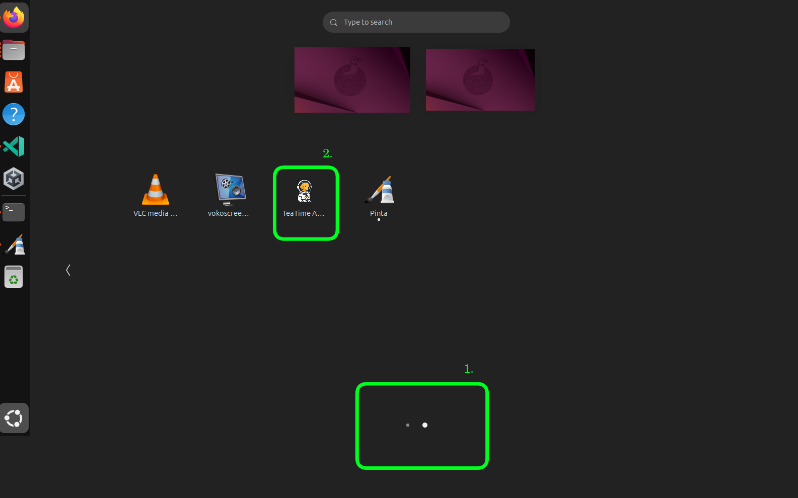
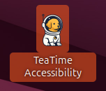

# TeaTime Accessibility

GUI based timer application (app) for the Ubuntu (Desktop) environment. With presets for time, reminders (including audible bell), basic statistics, visual effects (including gifs). 

_New features are added regularly_. Please see the [feedback](https://github.com/genidma/teatime-accessibility?tab=readme-ov-file#feedback) section towards the end of this Readme. 

## Release Notes

For information about the latest features, improvements, and bug fixes, please see [RELEASE_NOTES.md](RELEASE_NOTES.md).

## Features

- **Simple Timer**: Easy-to-use interface with start/stop controls
- **Visual Notifications**: Fullscreen alerts when your tea is ready
- **Sound Notifications**: Audible chime to complement visual notifications
- **Customizable Animations**: Choose from multiple animated sprites to display when timer completes
- **Accessibility Features**:
  - Large, clear display
  - High contrast mode
  - Font scaling options
  - Keyboard shortcuts
- **Statistics Tracking**: Automatic logging and viewing of tea sessions
- **Settings Dialog**: Configure animation preferences through a user-friendly interface
- **Mini-Mode**: Compact display mode for a smaller window footprint
- **Nano-Mode**: Ultra-compact mode with transparent background that shows only the timer digits
- **Custom Skins**: Personalize the appearance with different visual themes
- **Preset Durations**: Quick access to common tea brewing times

## Keyboard Shortcuts

- **Space**: Start/stop timer
- **Ctrl+S**: Start timer
- **Ctrl+T**: Stop timer
- **Ctrl+I**: Open statistics window
- **Ctrl+M**: Toggle sound on/off
- **Ctrl+,**: Open settings dialog
- **Ctrl++**: Increase font size
- **Ctrl+-**: Decrease font size
- **Ctrl+D**: Toggle mini-mode
- **Ctrl+N**: Toggle nano-mode
- **Ctrl+Q**: Quit application

## Mnemonics (Alt Keys)

Activate buttons and menu items by pressing Alt plus the underlined letter.

**Main Window:**
- **Alt+S**: Start
- **Alt+T**: Stop
- **Alt+E**: Enable Sound
- **Alt+M**: Mini Mode
- **Alt+N**: Nano Mode
- **Alt+4**: 45 Minutes
- **Alt+1**: 1 Hour

**Statistics Window:**
- **Alt+R**: Refresh Statistics
- **Alt+E**: Export to CSV
- **Alt+C**: Clear History

## Mini-Mode

TeaTime Accessibility includes a compact display mode called "Mini-Mode" which reduces the window size and makes the interface elements more compact. This is especially useful when you want to keep the timer visible but don't need the full interface.

To toggle Mini-Mode:
- Use the "Mini Mode" checkbox in the main interface
- Or use the keyboard shortcut **Ctrl+D**

Note: Some keyboard shortcuts may not work properly when in Mini-Mode due to the reduced interface size and focus handling. The Ctrl+D shortcut will always work to toggle Mini-Mode on and off.

## Nano-Mode

Includes an ultra-compact display mode called "Nano-Mode" which displays only the timer digits and colon with a transparent background. This mode is perfect for when you want a minimal, unobtrusive timer that floats on your desktop.

Features of Nano-Mode:
- Transparent background with no window decorations (title bar, borders)
- Only the timer digits and colon are visible
- Can be moved by clicking and dragging anywhere on the display. Press and hold the Meta key (usually the Windows key) on your keyboard and then click and drag anywhere on the window with the left mouse button
- Font size can still be adjusted using Ctrl++ and Ctrl+- even though the buttons are hidden
- Keyboard shortcuts still work. So to stop the timer in nano mode, you will do a ctrl+T. See the Keyboard Shortcuts section below for additional keyboard shortcuts.

To toggle Nano-Mode:
- Use the "Nano Mode" checkbox in the Settings dialog (accessed via Ctrl+,)
- Or use the keyboard shortcut **Ctrl+N**

When a timer is started with Nano-Mode enabled:
- The window automatically switches to the ultra-compact display
- All interface elements except the timer are hidden
- The window decorations are removed
- The background becomes transparent while preserving skin effects

When the timer completes or is stopped:
- The interface returns to its previous state (normal or mini mode)
- Window decorations are restored
- All interface elements become visible again

## Custom Skins

TeaTime Accessibility supports customizable visual themes:

- **Default Skin**: Standard grey background
- **Lava Lamp Skin**: Animated gradient background that flows like a lava lamp with dynamic colors

To select a skin:
1. Open the Settings dialog (Ctrl+, or from the menu)
2. Choose your preferred skin from the dropdown
3. Click OK to save your preference

Skins are preserved even in Nano-Mode, appearing as semi-transparent overlays behind the timer digits.

## Customizable Animations

The application supports multiple animated sprites that can be displayed when a timer completes. 
Currently included animations:
- Test animation (default)
- Puppy animation

To select which animation to display:
1. Open the Settings dialog (Ctrl+, or from the menu)
2. Choose your preferred animation from the dropdown
3. Click OK to save your preference

New animations can be added by creating a subdirectory in `assets/sprites/` with PNG frames 
following the naming pattern `*sprite_frame_*.png`.

## Statistics

Tea sessions are automatically logged with:
- Timestamp of when the timer completed
- Duration of the tea session

# Demo & Screenshots

- Opening the app using the icon
- Starting and Stopping the timer usnig the buttons (for demo purposes only)


## Stale Data here that needs to be removed
Main Window


A fun animation will appear upon completion of a session


Keyboard Shortcuts for ease of use


Statistics Engine and About Section


Screenshot of the main GUI (graphical user interface) from the latest version of the app


Screenshot of the Statistics engine that is built into the app. It automatically records the number of sessions by date. Including, breakdown for the Total number of sessions, Total Time for Sessions, Average Duration considering duration of all the Sessions


## Demos on Youtube
* [Shorter demo video on YT](https://youtu.be/gsrPCAagAtw?t=137)
* [40 + minute demo " " ](https://youtu.be/cgc0qMRA638)


## Accessibility Features

### Photosensitive Epilepsy Safe Version
* A photosensitive version of the app was created by @shanaya-gupta with further code modifications led by @genidma
* The photosensitive version does not have any visual effects, sudden screen changes and the timer updates every 5 seconds vs every second
* The latest stable photosensitive version of the app  [downloaded via the releases section](https://github.com/genidma/teatime-accessibility/releases)
* * Note the current Stable release for the photosensitive version is v.1.3.5. But best to check the Releases section directly in the future, as the Readme might be a bit stale

### Visual and Audio Accessibility
- **Rainbow 🌈 Glow**: Use tab on the keyboard ⌨️. As you cycle through the buttons they glow with a different color, each time the app is launched 
- **Live Regions**: Timer updates are announced visually and through the audio prompt (Simion's bell)

### Keyboard Accessibility
- **Full Keyboard Navigation**: Tab through all controls
- **Keyboard Shortcuts**:
  - `Ctrl+S`: Start timer
  - `Ctrl+T`: Stop timer
  - `Ctrl+I`: Show Statistics window
  - `Ctrl+M`: Toggle sound on/off
  - `Ctrl+,`: Open settings dialog
  - `Ctrl++`: Increase font size
  - `Ctrl+-`: Decrease font size
  - `Ctrl+Q`: Quit the application
- **Mnemonics (Alt Keys)**: Activate buttons and menu items by pressing `Alt` plus the underlined letter.
  - **Main Window:**
    - `Alt+S`: **S**tart
    - `Alt+T`: S**t**op
    - `Alt+E`: **E**nable Sound
    - `Alt+4`: **4**5 Minutes
    - `Alt+1`: **1** Hour
  - **Statistics Window:**
    - `Alt+R`: **R**efresh Statistics
    - `Alt+E`: **E**xport to CSV
    - `Alt+C`: **C**lear History

## Installation

### Prerequisites
Before running the install script, please install the required system dependencies. Note: See instructions on how to open a terminal and if you are new to Linux:

```bash
sudo apt install python3-dev libgirepository1.0-dev gcc libcairo2-dev pkg-config python3-venv gir1.2-gtk-3.0
```

For better compatibility, we also recommend installing the system-wide PyGObject packages:

```bash
sudo apt install python3-gi python3-gi-cairo gir1.2-gtk-3.0
```

### Automatic Installation (Recommended)
First, clone the repository to a location of your choice, then run the install script:

```bash
git clone <repository-url>
cd teatime-accessibility
./install.sh
```

This script will:
1. Create a virtual environment with access to system packages (if one doesn't already exist)
2. Install all required dependencies
3. Create a desktop shortcut/icon for quick access (if you choose this option during the install)
4. Make the launcher script executable

The install script will also prompt you to install system dependencies if needed.

### Manual Installation
If you prefer to install manually:

1. Create a virtual environment with access to system packages:
   ```bash
   python3 -m venv teatime-venv --system-site-packages
   source teatime-venv/bin/activate
   ```

2. Install dependencies (if needed):
   ```bash
   pip install -r requirements.txt
   ```

3. Create desktop entry (optional):
   ```bash
   mkdir -p ~/.local/share/applications
   cp teatime-accessibility.desktop ~/.local/share/applications/
   ```
   
   You can also create a desktop shortcut for direct access:
   ```bash
   cp teatime-accessibility.desktop ~/Desktop/
   ```

After running these commands, you'll find "TeaTime Accessibility" in the Utilities section of your application menu. The desktop entry will be created at `~/.local/share/applications/teatime-accessibility.desktop`. If you choose to create a desktop shortcut during the installation process, you can also launch the app directly from your desktop in future instances.

## Installation Locations

When you run the install script, here's exactly where each component is installed:

1. **Virtual Environment**: 
   - Location: Inside the project directory as `teatime-venv/`
   - This is a local virtual environment that stays within your project folder

2. **Desktop Entry**:
   - Location: `~/.local/share/applications/teatime-accessibility.desktop`
   - This allows the app to appear in your system's application menu under "Utilities"

3. **Desktop Shortcut** (if you choose to create one):
   - Location: On your desktop (e.g., `~/Desktop/teatime-accessibility.desktop`)
   - This provides a direct shortcut icon on your desktop

4. **Application Files**:
   - All application files remain in your project directory (wherever you cloned the repository)
   - This includes the main Python script, assets, and configuration files

5. **User Data**:
   - Configuration: `~/.config/teatime_config.json`
   - Statistics: `~/.local/share/teatime_stats.json`

The important thing to note is that the application itself is not moved or copied elsewhere - it runs directly from your project directory. The install script simply:
1. Sets up the virtual environment for isolated dependencies
2. Creates convenient access points (desktop entry and/or desktop shortcut)
3. Ensures all necessary components are properly configured

This approach keeps everything contained within your project directory while providing convenient access methods through the standard desktop environment interfaces.

## Usage

After installation, you can run the application in one of the following ways:

### Option 1: Main 'Activities Menu'
1. Click on the 'Activities Menu' in Ubuntu Desktop. Highlighted with a Green Rectangle (with circular edges in the screenshot below)

   
   
2. Depending on how many apps you have installed on your computer, you might have to scroll to the following views. 

In the illustration below: The icon for the app appears on the second page (or view). You either scroll to this location or you can click on the dots that you see at the bottom of the screen.

Screenshot below for visual representation:
Where (the same Green Rectangle with circular edges as in the previous screenshot) represents:

    1.  (within the screenshot directly) the mechanism via which you can scroll through the views. 

    And

    2.icon for the app itself
   
3. Click on the application icon to launch it

### Option 2: Desktop Shortcut
If you chose to create a desktop shortcut during installation:
1. Navigate to your desktop
2. Right-click on the "TeaTime Accessibility" icon
3. Select "Allow Launching" from the context menu
5. Double-click the icon to launch the application
4. As of 2025-10-16, the icon looks like this. 

   

On Ubuntu Desktop, the icon will look like this (below):

   

Fyi only: The icon looks larger in the illustrations here. The icons on your computer will be the same size as any other icon on your Ubuntu Desktop. 

The application will appear in your system tray (notification area) and can be controlled from there.

Note: The virtual environment is created in the project directory and persists between sessions. It only needs to be recreated if you manually delete it or run the uninstall script. For the desktop shortcut, you must first right-click on the icon and select "Allow Launching" from the context menu before you can use it to start the application.

### Option 3: Command Line
1. Navigate to the project directory (the location on your computer, where you originally cloned the repository)
2. Activate the existing virtual environment:
   ```bash
   source teatime-venv/bin/activate
   ```
3. Run the application:
   ```bash
   ./teatime-accessible.sh
   ```

### Command Line Options for Duration
A custom duration can be specified via the GUI and also via the command line. As a note on the aside, durations are always in minutes.

To do this on the command line:

1. Open a [terminal](https://ubuntu.com/tutorials/command-line-for-beginners#3-opening-a-terminal) and navigate to the project directory
2. In the example directly below, a 5 minute range has been specified for the duration. You still have to click on Start manually: 

```bash
# Range for duration (1-999 minutes)
# Example below
./teatime-accessible.sh --duration 5
```

When you launch the application with the `--duration` parameter, the specified value will be pre-filled in the minutes input field within the GUI. And you can choose any value specified in the 'range' above

As another example, if you frequently use a 30-minute timer. You could simply change/specify the duration like this:
```bash
./teatime-accessible.sh --duration 30
```

This eliminates the need to manually adjust the timer duration, each time you start the application.

### Configuration
Settings are automatically saved to `~/.config/teatime/settings.json` including:
- Font scale preference
- Default timer duration

## Dependencies
- GTK 3.0+
- Python 3.8+
- PyGObject
- PulseAudio (for sound notifications)

## Uninstalling the Application

### Automatic Uninstall (Recommended)
Run the uninstall script from the project directory:

```bash
./uninstall.sh
```

This script will:
1. Remove the desktop entry
2. Ask if you want to remove the virtual environment
3. Preserve your configuration and statistics

### Manual Uninstall
To manually uninstall:

1. Remove the desktop entry:
   ```bash
   rm ~/.local/share/applications/teatime-accessibility.desktop
   ```

2. To remove the desktop shortcut:
   ```bash
   rm ~/Desktop/teatime-accessibility.desktop
   ```

3. To remove the virtual environment:
   ```bash
   rm -rf teatime-venv
   ```

4. To remove configuration and statistics:
   ```bash
   rm ~/.config/teatime_config.json
   rm ~/.local/share/teatime_stats.json
   ```

## Development
The application consists of several scripts, each with a specific purpose:

- `bin/teatime.py`: The main Python application script, which programmatically builds the GTK3 user interface.

- `teatime-accessible.sh`: The launcher script that activates the virtual environment (if available) and starts the application. This is the recommended way to run the application as it ensures proper environment setup.

- `install.sh`: The installation script that:
  - Creates a Python virtual environment with system site packages access
  - Installs all required dependencies from requirements.txt
  - Sets up desktop integration by creating a .desktop file
  - Makes the launcher script executable
  - Optionally creates a desktop shortcut

- `uninstall.sh`: The removal script that:
  - Removes the desktop entry from the applications menu
  - Optionally removes the virtual environment
  - Preserves user configuration and statistics by default

- `teatime-accessibility.desktop`: The desktop entry file that integrates the application with the system's application menu and desktop environment.

- `requirements.txt`: Lists all Python package dependencies required for the application to run.

- `test_short_timer.py`: Test script used during development to verify timer functionality.

The application stores user configuration in `~/.config/teatime_config.json` and session statistics in `~/.local/share/teatime_stats.json`.

## Testing Tools

Script designed to verify application functionality (without having to wait for the timer to go off):

### test_short_timer.py
- Launches the app with a 1 second timer (see Usage below)
- Automatically starts the timer without manual intervention

**Usage:** git checkout main

####  Run with duration in seconds instead of minutes
```
python3 test_short_timer.py --duration 1 --use-seconds
```

### bin/teatime-tasks-priority-test.py
Script for project management that:
- Fetches open issues from the GitHub repository
- Categorizes them by type (bug, feature, enhancement, documentation)
- Prioritizes them by priority level (high, medium, low)
- Classifies them by complexity (simple, medium, complex)
- Generates recommended task order for development

**Usage:**
```bash
python3 bin/teatime-tasks-priority-test.py
```

Note: For authenticated requests (to avoid rate limiting), you can set a GITHUB_TOKEN environment variable with a GitHub personal access token.

## Feedback
Here's how you can reach out:

- **[Create an issue](https://github.com/genidma/teatime-accessibility/issues)** if you:
  - Found a bug or something isn't working as expected
  
- **[Start a discussion](https://github.com/genidma/teatime-accessibility/discussions)** if you:
  - Have ideas :bulb: or suggestions for improvements
  - Want to propose a new feature
  - Need help using the application
  - Want to share your experience or ask general questions

Issues are best for reporting problems that need to be fixed, while discussions are perfect for ideas, suggestions, and questions. 

## License
Originally inspired by the Tea Timer application from the Ubuntu snap store [link](https://snapcraft.io/install/teatime/ubuntu). By now, the code is entirely different and keeps evolving. The release(s) are also with with a different licensing policy.

## Credits
* For a complete list of credits, please see [CREDITS.md](CREDITS.md)