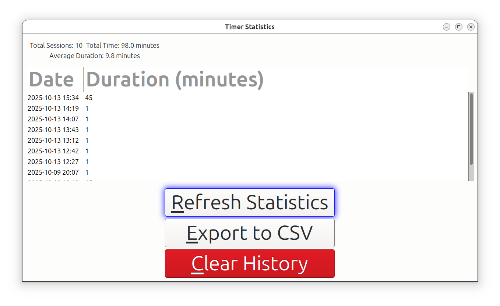

# TeaTime Accessibility

TeaTime Accessibility is a tool designed to help users manage screen time with a focus on accessibility. It provides features such as timers, reminders, and usage statistics.

## Features

- **Timer:** Set custom break intervals for better productivity.
- **Accessibility Integration:** Works seamlessly with screen readers and other assistive technologies.
- **Usage Statistics:** Tracks your session times and provides insights into your computer usage habits. The statistics are stored in `~/.local/share/teatime_stats.json`.

### Stats Data

The application reads and writes stats data from/to the following file:

`~/.local/share/teatime_stats.json`

# Accessible Tea Timer

An simpler version of the Tea Timer application with enhanced accessibility features.


Screenshot of the main GUI (graphical user interface) from version 1.3.3 of the app


Screenshot of the Statistics engine that is built into the app. It automatically records the number of sessions by date. Including, breakdown for the Total number of breaks, Total Time for Sessions, Average Duration considering duration of all the Sessions


## Accessibility Features

### Visual Accessibility
- **Adjustable Font Size**: Use A+ and A- buttons or Ctrl++ and Ctrl+- to increase/decrease font size
- **High Contrast Support**: Automatically adapts to system theme settings
- **Clear Visual Feedback**: Button states and status messages provide clear feedback
- **Rainbow 🌈 Glow**: Use tab on the keyboard ⌨️. As you cycle through the buttons they glow with a different color, each time the app is launched 

### Keyboard Accessibility
- **Full Keyboard Navigation**: Tab through all controls
- **Keyboard Shortcuts**:
  - `Ctrl+S`: Start timer
  - `Ctrl+T`: Stop timer
  - `Ctrl++`: Increase font size
  - `Ctrl+-`: Decrease font size
- **Focus Management**: Proper focus order and visual focus indicators

### Screen Reader Support
- **Proper Labels**: All controls have descriptive labels
- **Status Updates**: Status changes are announced to screen readers
- **Role Definitions**: UI elements have proper ARIA roles
- **Live Regions**: Timer updates are announced appropriately

### Audio Accessibility
- **Sound Notifications**: Audio feedback (bell 🔔 )at the completion of each session 
- **Desktop Notifications**: System notifications for timer completion
- **Fallback Sounds**: System bell if audio files aren't available

## Installation
Run the setup script:

```bash
./setup.sh
```
## Usage

### Running the Application
From the project's root directory, run either of the following options:

**Option 1: Command line**
```bash
./teatime-accessible.sh
```

**Option 2: GUI Startup Menu**
1. Open your desktop environment's application menu
2. Look for "TeaTime Accessibility" under the "Utilities" or "Accessories" category
3. Click on the application icon to launch it

The application will appear in your system tray (notification area) and can be controlled from there.

### Command Line Options - broken at the moment. tracked in issue.
```bash
# Set default duration (1-999 minutes)
./teatime-accessible --duration 5
```

### Configuration
Settings are automatically saved to `~/.config/teatime/settings.json` including:
- Font scale preference
- Default timer duration

## Dependencies
- GTK 3.0+
- Python 3.8+
- PyGObject
- PulseAudio (for sound notifications)

## Uninstalling the Application (If you'd like to)

First make the script executable
```bash
chmod +x uninstall.sh
```
Then, run the uninstall script to remove the application

```bash
./uninstall.sh
```

## Development
The application consists of:
- `bin/teatime.py`: The main Python application script, which programmatically builds the GTK3 user interface.

## License
Originally inspired by the Tea Timer application from the Ubuntu snap store [link](https://snapcraft.io/install/teatime/ubuntu). But the code is significantly different with a different licensing policy.
