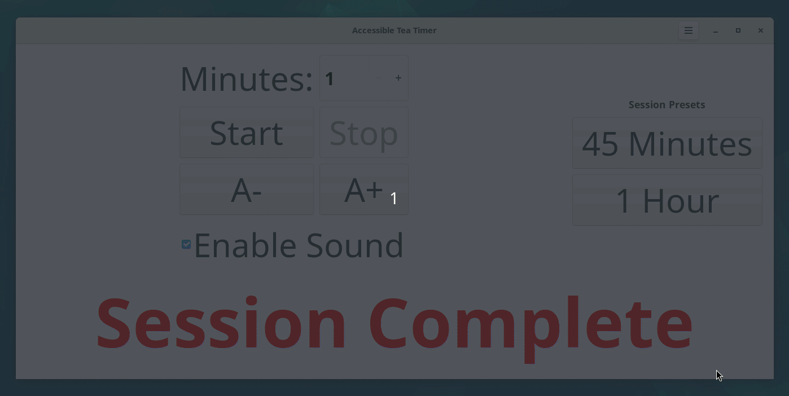
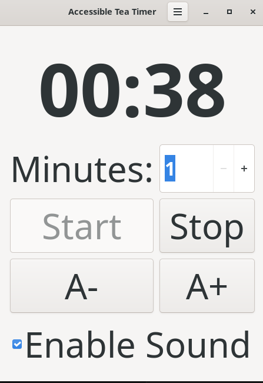
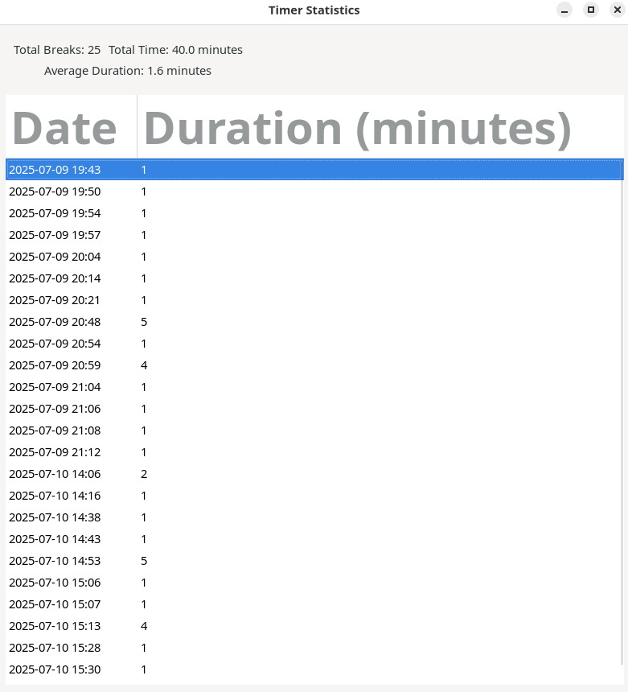

# Accessible Tea Timer

An simpler version of the Tea Timer application with enhanced accessibility features.



Screenshot of the main GUI (graphical user interface) from version 1.3.2 of the app


Screenshot of the Statistics engine that is built into the app. It automatically records the number of sessions by date. Including, breakdown for the Total number of breaks, Total Time for Sessions, Average Duration considering duration of all the Sessions


## Accessibility Features

### Visual Accessibility
- **Adjustable Font Size**: Use A+ and A- buttons or Ctrl++ and Ctrl+- to increase/decrease font size
- **High Contrast Support**: Automatically adapts to system theme settings
- **Clear Visual Feedback**: Button states and status messages provide clear feedback
- **Tooltips**: Hover tooltips explain what each control does

### Keyboard Accessibility
- **Full Keyboard Navigation**: Tab through all controls
- **Keyboard Shortcuts**:
  - `Ctrl+S`: Start timer
  - `Ctrl+T`: Stop timer
  - `Ctrl++`: Increase font size
  - `Ctrl+-`: Decrease font size
- **Focus Management**: Proper focus order and visual focus indicators

### Screen Reader Support
- **Proper Labels**: All controls have descriptive labels
- **Status Updates**: Status changes are announced to screen readers
- **Role Definitions**: UI elements have proper ARIA roles
- **Live Regions**: Timer updates are announced appropriately

### Audio Accessibility
- **Sound Notifications**: Audio feedback for start, stop, and completion
- **Desktop Notifications**: System notifications for timer completion
- **Fallback Sounds**: System bell if audio files aren't available

## Installation
Run the setup script:

```bash
./setup.sh
```
## Usage

### Running the Application
From the project's root directory, run the following command:
```bash
./teatime-accessible.sh
```

### Command Line Options
```bash
# Set default duration (1-999 minutes)
./teatime-accessible --duration 5
```

### Configuration
Settings are automatically saved to `~/.config/teatime/settings.json` including:
- Font scale preference
- Default timer duration

## Dependencies
- GTK 3.0+
- Python 3.8+
- PyGObject
- PulseAudio (for sound notifications)

## Uninstalling the Application (If you'd like to)

First make the script executable
```bash
chmod +x uninstall.sh
```
Then, run the uninstall script to remove the application

```bash
./uninstall.sh
```

## Development
The application consists of:
- `bin/teatime.py`: The main Python application script, which programmatically builds the GTK3 user interface.

## License
Originally inspired by the Tea Timer application from the Ubuntu snap store [link](https://snapcraft.io/install/teatime/ubuntu). But the code is significantly different with a different licensing policy.
