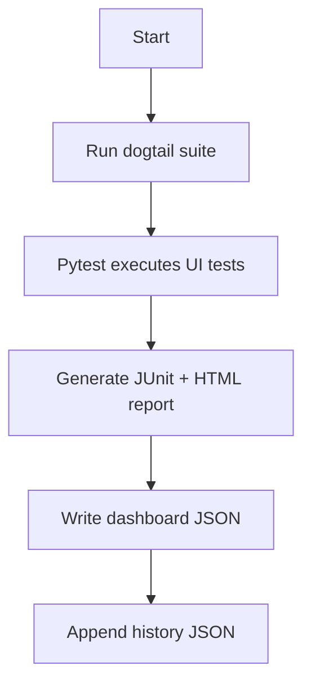

# GUI Testing Guide (Dogtail)

This guide explains how to run the Dogtail GUI tests for TeaTime Accessibility, how to update the dashboard, and how to troubleshoot common failures. It is written for first-time test runners.

## Prerequisites

- Linux desktop session running X11 (not Wayland).

To confirm you are on X11, run the following commands from a terminal inside of a GUI based session (not over ssh):
```bash
echo $XDG_SESSION_TYPE
```

If it prints `wayland`, log out and choose an X11 session (note: for me this is xfce) at the login screen (often labeled `GNOME on Xorg` or `Plasma (X11)` using the wheel at the login screen), then log back in and re-check.
If it prints `tty`, you are not in a graphical session; start a desktop session first.

- `which dbus-run-session` available.

if it's not install, install it via:
`sudo apt install -y dbus-x11`

- Python 3 installed.
- Project python virtual environment created (see project setup docs).
- Project python virtual environment activated

`source teatime-venv/bin/activate`

- `dogtail` installed in the active environment.

If you are unsure about Dogtail availability, run:
```bash
python -c "import dogtail; print('dogtail ok')"
```

### Switching Between Wayland and X11 (Ubuntu)

These steps apply to Ubuntu 25.10 with the default GDM login screen.

Switch to X11:
1. Log out.
2. On the login screen, select your user.
3. Click the gear icon in the lower-right.
4. Choose `Ubuntu on Xorg`.
5. Log in and run `echo $XDG_SESSION_TYPE` (should print `x11`).

Switch back to Wayland:
1. Log out.
2. On the login screen, select your user.
3. Click the gear icon.
4. Choose `Ubuntu` (Wayland).
5. Log in and run `echo $XDG_SESSION_TYPE` (should print `wayland`).

## Quick Start (First Run)

1. Go to the folder where the repository was cloned and please ensure that you are in the project root (the folder that contains `tests/`).
2. Confirm prerequisites above.
3. Activate the project virtual environment:
```bash
source teatime-venv/bin/activate
```
4. Run the dashboard runner:
```bash
python tests/run_dogtail_suite.py
```
5. Open the HTML report and check the dashboard JSON.

Expected outputs:
- `tests/reports/dogtail_report_shard1.html` (HTML report, when running a single shard)
- `tests/reports/dogtail_dashboard.json` (latest run summary)
- `tests/reports/dogtail_history.json` (run history and durations)

> Note: The Dogtail tests are intended for Linux + X11. If you are on another OS, run them inside a Linux VM or container with X11 forwarding.

## Test Flow (Mermaid)



## How the Mechanism Works

- **Comprehensive coverage**: the manifest enumerates all UI tests by group, so the runner can enforce "run everything" or specific groups.
- **Machine profiling**: `--profile-machine` reports CPU/load/mem and a recommended concurrency.
- **Staggering / concurrency control**: `--max-procs` and `--stagger-seconds` control how many shards start at once, with optional `--nice`.
- **Dashboard update**: every run writes `tests/reports/dogtail_dashboard.json` (latest) and appends to `tests/reports/dogtail_history.json` (history + timings).

## Key Commands

```bash
# profile the test machine (for concurrency guidance)
python tests/run_dogtail_suite.py --profile-machine

# run full suite and update dashboard
python tests/run_dogtail_suite.py

# run a specific group
python tests/run_dogtail_suite.py --group smoke

# staggered run with priority (safe default is max-procs 1)
python tests/run_dogtail_suite.py --max-procs 1 --stagger-seconds 2 --nice 10
```

## Running the Legacy Runner

The legacy runner is still supported and can be useful for triage or quick iteration.

```bash
./tests/run_dogtail_tests.sh
```

Estimate run time:
```bash
./tests/run_dogtail_tests.sh --estimate
```

Run a subset with lower priority:
```bash
nice -n 19 ./tests/run_dogtail_tests.sh --triage settings
```

## Dashboard-to-Doc Mapping

If you see issues in the dashboard or the HTML report, use the mapping below.

| Dashboard Signal | Likely Cause | Recommended Command |
| :--- | :--- | :--- |
| `SearchError` | Element renamed or hidden | `pytest tests/test_ui_dogtail.py -k <test_name> -v` |
| `AttributeError` | App failed to launch/register | `atspi-registry --list-apps | grep teatime` |
| `Timeout` | System lag or DBus stall | `./tests/run_dogtail_tests.sh --triage <failed_test>` |
| `CheckedState Error` | Animation blocking click | `export DOGTAIL_SLEEP_DELAY=2.0 && ./tests/run_dogtail_tests.sh` |

## Outputs and Logs

- HTML report: `tests/reports/dogtail_report_shard1.html`
- Dashboard summary: `tests/reports/dogtail_dashboard.json`
- History: `tests/reports/dogtail_history.json`
- Dogtail logs: `/tmp/dogtail-$USER/logs/`

To open the HTML report in a browser:
```bash
xdg-open tests/reports/dogtail_report.html
```

## Improvements Implemented (Background)

These changes make tests more resilient and easier to debug:

- **Robust element selection**: `find_child_fuzzy` handles minor label variations and prioritizes widget roles.
- **Enhanced diagnostic logging**: `capture_ui_state()` dumps the UI tree on failure, and Dogtail debug logging captures search attempts.
- **Stabilized runner**: `tests/run_dogtail_tests.sh` uses `dbus-run-session` and creates a self-contained HTML report.

## Troubleshooting Checklist

- App not found: confirm `teatime-accessible.sh` launches the app and that AT-SPI is running.
- Search errors: use `dump_atspi_tree.py` to inspect widget names and roles.
- Flaky clicks: increase `DOGTAIL_SLEEP_DELAY` and re-run the specific test.
- Timeouts: use `--triage` and run fewer tests per session.

## Glossary

- **AT-SPI**: Accessibility API used by Dogtail to introspect the UI.
- **DBus**: IPC system used by accessibility services and test sessions.
- **Shard**: A subset of tests run as a group for scheduling or parallelization.
